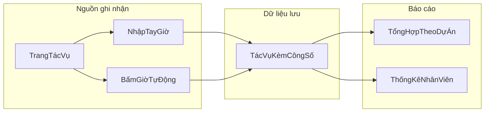

# Bài báo: Ghi nhận công số nhân viên trên hệ thống CAILY

Tài liệu này dùng để làm nội dung thuyết trình PowerPoint cho người không làm IT. Ngôn ngữ được giữ đơn giản, tập trung vào việc hệ thống giúp ghi nhận thời gian làm việc như thế nào và mang lại lợi ích gì.

---

## Slide 1 - Tiêu đề

**Ghi nhận công số nhân viên trên trang Quản lý tác vụ (タスク管理)**

- Hệ thống áp dụng: CAILY
- Màn hình chính: `group/caily/project/task.php`
- Mục tiêu: trả lời rõ 3 câu hỏi: ai ghi, ghi cái gì, ghi để làm gì

---

## Slide 2 - Mục đích

### Vì sao cần ghi nhận công số?

- Nếu không có số liệu công số, quản lý khó biết nhân viên đã dành bao nhiêu thời gian cho từng việc.
- Dự án dễ bị trễ mà không phát hiện sớm vì thiếu dữ liệu theo dõi.
- Khó tách bạch thời gian cho việc làm mới và thời gian sửa lỗi.

### Hệ thống CAILY giải quyết điểm nào?

- Ghi lại số giờ làm việc ngay trên từng tác vụ.
- Tự gom dữ liệu theo dự án, theo nhân viên, theo nhóm.
- Tạo nền tảng để đánh giá tiến độ và phân công công việc công bằng hơn.

---

## Slide 3 - Bức tranh tổng quan

Thông điệp chính của slide: nhân viên chỉ cần ghi công số đúng ở trang tác vụ, hệ thống sẽ tự tổng hợp thành báo cáo cho quản lý.

---

## Slide 4 - Cách thực hiện: vào đúng màn hình

1. Mở dự án cần làm.
2. Vào tab **タスク (Tác vụ)**.
3. Tìm tác vụ của mình; có thể bật bộ lọc **「自分のタスクのみ」** để chỉ thấy việc mình phụ trách.

Nội dung này phù hợp cho người dùng mới, giúp họ bắt đầu nhanh mà không cần hiểu kỹ thuật.

---

## Slide 5 - Cách thực hiện: nhập tay công số

Ở cột **工数** (công số), người dùng nhập trực tiếp số giờ:

- Ví dụ: `2.5` nghĩa là 2 giờ 30 phút.
- Sau khi lưu, số giờ được gắn với tác vụ đó.
- Người có quyền phù hợp (quản lý hoặc người được giao việc) mới sửa được.

Nên nhấn mạnh trong slide:

- Nhập ngay sau khi làm xong một việc để tránh quên.
- Dùng cùng một cách nhập trong đội để dữ liệu đồng nhất.

---

## Slide 6 - Cách thực hiện: bấm giờ tự động

Ngoài nhập tay, hệ thống có nút bấm giờ:

- Nhấn **bắt đầu** khi vào việc.
- Nhấn **dừng** khi kết thúc.
- Số giờ vừa làm sẽ tự cộng vào công số hiện có của tác vụ.

Điểm quan trọng, dễ hiểu:

- Một người chỉ nên chạy một phiên bấm giờ tại một thời điểm.
- Khi tác vụ đã hoàn thành hoặc hủy, việc bấm giờ sẽ không còn phù hợp.
- Cách này giúp giảm sai sót do nhớ nhầm thời gian.

---

## Slide 7 - Thông tin đi kèm ảnh hưởng đến thống kê

Để báo cáo đúng, cần khai báo đúng các mục sau khi tạo hoặc sửa tác vụ:

- **Loại công việc (種別)**: làm mới, sửa lỗi, sửa thay đổi, hoặc nhóm việc khác.
- **Người phụ trách (担当者)**: công số được tính cho người này.
- **Số bản vẽ (図面)** nếu công việc liên quan bản vẽ.

Nếu chọn sai loại công việc, báo cáo theo nhóm việc sẽ lệch; vì vậy đây là bước quan trọng trong quy trình vận hành.

---

## Slide 8 - Thống kê dữ liệu công số ở cấp dự án

Ngay trên trang tác vụ, hệ thống hiển thị các chỉ số tóm tắt:

- **タスク総数**: tổng số tác vụ.
- **工数合計**: tổng số giờ đã ghi nhận.
- **完了済み**: số tác vụ đã hoàn thành.
- **期限切れ**: số tác vụ trễ hạn.

Ý nghĩa cho quản lý:

- Nhìn nhanh sức khỏe dự án tại thời điểm hiện tại.
- Phát hiện sớm dự án có xu hướng chậm tiến độ.

---

## Slide 9 - Thống kê dữ liệu công số ở cấp nhân viên / nhóm

Trang dùng cho quản lý: `group/caily/project/employee_statistics.php`

Các bước xem báo cáo:

1. Chọn khoảng thời gian.
2. Lọc theo phòng ban hoặc nhóm.
3. Bấm **統計計算** để hệ thống tổng hợp.
4. Xem theo tab: phòng ban, nhóm, nhân viên, tổng kết năm.

Các chỉ số quan trọng nên đưa lên slide:

- Tổng công số.
- Công số theo loại việc (làm mới, sửa lỗi, sửa thay đổi, việc khác).
- Số tác vụ đã làm.
- Số bản vẽ và doanh thu bản vẽ (nếu áp dụng).
- Lượt đánh giá tốt/chưa tốt.

---

## Slide 10 - Kỳ vọng kết quả cho nhân viên và quản lý

### Với nhân viên

- Dễ ghi nhận thời gian làm việc, giảm tranh cãi về khối lượng công việc.
- Có dữ liệu rõ ràng để tự theo dõi hiệu suất cá nhân.

### Với quản lý

- Nắm được dự án nào đang tốn nhiều giờ nhất.
- Biết nhóm nào đang quá tải để điều phối lại.
- So sánh năng suất giữa các giai đoạn theo dữ liệu thực tế.

---

## Slide 11 - Điều kiện để kết quả chính xác

- Luôn gán đúng người phụ trách trước khi ghi công số.
- Chọn đúng loại công việc để phân loại báo cáo không sai.
- Ghi công số thường xuyên (hàng ngày), không dồn cuối tháng.
- Thực hiện tính thống kê định kỳ để dữ liệu báo cáo luôn mới.

Nội dung này nên được trình bày như “quy tắc vận hành” của đội.

---

## Slide 12 - Kết luận và hạng mục bổ sung

### Kết luận ngắn gọn

Ghi nhận công số trong CAILY giúp biến dữ liệu làm việc hằng ngày thành thông tin quản trị: minh bạch, đo được, và có thể cải thiện theo thời gian.

### Hạng mục bổ sung nên nêu trong báo cáo

- Phân quyền: ai được xem, ai được sửa.
- Liên kết dữ liệu giữa tác vụ và bản vẽ.
- Hạn chế hiện tại: dữ liệu vẫn phụ thuộc vào việc người dùng ghi đúng và đủ.
- Kế hoạch cải tiến: chuẩn hóa quy trình nhập liệu, đào tạo ngắn cho nhân viên mới.

---

## Phụ lục: từ khóa tiếng Nhật thường gặp

| Tiếng Nhật | Ý nghĩa dễ hiểu |
|---|---|
| 工数 | Số giờ làm việc |
| タスク | Công việc / tác vụ |
| 種別 | Loại công việc |
| 図面 | Bản vẽ |
| 担当者 | Người phụ trách |
| 従業員統計 | Thống kê nhân viên |
| 統計計算 | Tính thống kê |
